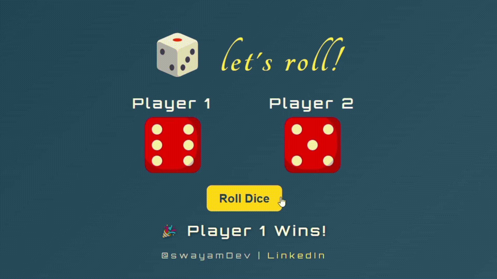

# 🎲 Dice Game  

A simple Dice Game built using HTML, CSS, and JavaScript.  

## Description  
This project is a browser-based implementation of a two-player dice game. Players roll dice to compete, with the game determining the winner based on the highest roll. The project demonstrates core JavaScript concepts, DOM manipulation, and incorporates a modern, responsive design for an engaging experience.  

## Demo  
Here's the gameplay in action:  

  

## JavaScript Built-in Methods Used  
- `Math.random()`  
- `Math.floor()`  
- `addEventListener()`  
- `querySelector()`  
- `setAttribute()`  
- `textContent`  

## License  
This project is licensed under the MIT License. Feel free to use, modify, and share it with attribution. Whether for learning, projects, or fun, it's yours to explore! 😊 See the LICENSE file for more details.  
